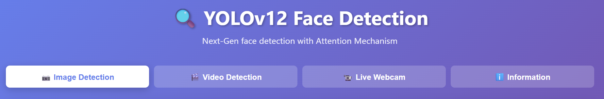

# 🔍 YOLOv12 Human Face Detection Web Application

[](https://huggingface.co/spaces/RevDra/YOLOv12_HFD)
[](LICENSE)
[](https://www.python.org/downloads/)
[](config/Dockerfile)
[](https://github.com/RevDra/human-face-detection/actions/workflows/docker-publish.yml)

<br>
<div align="center">
  
</div>
<br>

A professional, real-time face detection system built with YOLOv12 and Flask. This project leverages the latest Attention Mechanism features of YOLOv12 to detect faces in images, videos, and live webcam streams with state-of-the-art accuracy and speed.
View the demo using this [link](https://revdra-yolov12-hfd.hf.space/).

## ✨ Features

### 📷 Image Detection
- Upload and detect faces in images (JPG, PNG, GIF)
- Attention-based detection for small/occluded faces
- Real-time detection with confidence scores
- Download annotated result images
- Display face statistics (count, position, size)

### 🎬 Video Detection
- Process video files (MP4, AVI, MOV, MKV)
- Annotate each frame with bounding boxes
- Download processed video

### 📹 Live Webcam
- Real-time detection from your webcam
- Side-by-side video feed and detection results
- Live statistics (FPS, face count, duration)
- Start/stop controls

### 🤖 Model Selection
- **YOLOv12 Nano** (yolov12n-face.pt) - Super Fast, best for CPU/Webcam
- **YOLOv12 Small** (yolov12s-face.pt) - Balanced speed & accuracy
- **YOLOv12 Medium** (yolov12m-face.pt) - High precision
- **YOLOv12 Large** (yolov12l-face.pt) - State-of-the-art accuracy

## 🚀 Quick Start

### Prerequisites
- Python 3.10+
- Required packages (see below)

### Installation

1. **Install dependencies:**
```bash
pip install -r requirements.txt
```

2. **Run the web server:**
#### Linux/Mac
```bash
./config/deploy.sh start
```

#### Windows
```bash
config\deploy.bat start
```

3. **Open in browser**
https://localhost:7860

## 📁 Project Structure

```
Human_face_detection/
├── .github/                            # CI/CD & Automation
│   ├── ISSUE_TEMPLATE/                 # Community Forms
│   │   ├── bug_report.md               # Bug report template
│   │   ├── config.yml                  # Discussions link config
│   │   └── feature_request.md          # Feature request template
│   ├── workflows/
│   │   └── docker-publish.yml          # Auto-build Docker Image
│   └── dependabot.yml                  # Automated Dependency Updates
│
├── assets/                             # Project Images & Screenshots
│   └── demo_ui.png                     # Interface preview for README
│
├── config/                             # Configuration & Deployment scripts
│   ├── Dockerfile                      # Docker image config
│   ├── docker-compose.yml              # Docker Compose setup
│   ├── deploy.sh                       # Linux deployment script
│   ├── deploy.bat                      # Windows deployment script
│   └── DEPLOYMENT_GUIDE.md             # Detailed deployment guide
│
├── models/                             # YOLOv12 Models
│   ├── yolov12n-face.pt                # Nano model (Fastest)
│   ├── yolov12s-face.pt                # Small model (Balanced)
│   └── MODELS.md                       # Download instructions for Med/Large models
│
├── src/                                # Source Code
│   ├── web_app.py                      # Flask web server
│   └── face_detection_yolov12.py       # YOLOv12 detection engine
│
├── web/                                # Frontend Assets
│   └── templates/
│       └── index.html                  # Web UI
│
├── CODE_OF_CONDUCT.md                  # Community guidelines
├── CONTRIBUTING.md                     # Contribution guidelines
├── LICENSE                             # AGPL v3 License
├── README.md                           # Main documentation
├── SECURITY.md                         # Security policy
└── requirements.txt                    # Python dependencies
```

## 🐳 Docker Support (Recommended)
You can run the application instantly without installing Python or dependencies manually.

**Prerequisites:** [Docker Desktop](https://www.docker.com/products/docker-desktop) installed.

1. **Clone the repository:**
```bash
git clone [https://github.com/](https://github.com/)RevDra/human-face-detection.git
cd Human_face_detection
```
   
2. **Run with Docker Compose:**
```bash
# Build and run with Docker Compose (from project root)
docker-compose -f config/docker-compose.yml up --build

# Or build manually
docker build -t yolov12-face-detection -f config/Dockerfile .
docker run -p 7860:7860 -v $(pwd)/data:/app/data yolov12-face-detection
```
   
3. **Access the App:**
   Open `http://localhost:7860` in your browser.

## 🔧 API Endpoints

| Method | Endpoint | Description |
|--------|----------|-------------|
| GET | `/` | Web interface |
| POST | `/api/detect-image` | Detect faces in uploaded image |
| POST | `/api/detect-video` | Detect faces in uploaded video |
| GET | `/api/models` | List available models |
| GET | `/api/health` | Health check |
| GET | `/api/download/<filename>` | Download processed files |

## 💻 Usage

### Via Web Interface
1. Select a detection model
2. Upload an image/video or start webcam
3. Wait for processing
4. View results and download if needed

### Via API (Python Example)
```python
import requests

# Detect faces in image
with open('image.jpg', 'rb') as f:
    files = {'file': f}
    data = {'model': 'yolov12l-face.pt'}
    response = requests.post('http://localhost:7860/api/detect-image', 
                            files=files, data=data)
    result = response.json()
    
print(f"Detected {result['detections']['count']} faces")
```

## 📊 Detection Details

### Confidence Threshold
Default: 0.35 (35%)
- Higher threshold = fewer false positives but may miss faces
- Lower threshold = more detections but more false positives

### Output Includes
- Bounding box coordinates (x1, y1, x2, y2)
- Confidence score (0-100%)
- Face dimensions (width × height)
- Face position on image

## ⚙️ Configuration

Edit `web_app.py` to modify:
- `MAX_FILE_SIZE` - Maximum upload size (default: 500MB)
- `UPLOAD_FOLDER` - Temporary file location
- `PORT` - Application port (default: 7860)

## 📝 Notes

### Model Files Required
Three model files are required in the `models/` directory:
- `yolov12n-face.pt` (5.3 MB) ✅ Included
- `yolov12s-face.pt` (18.5 MB) ✅ Included
- `yolov12m_face.pt` (39.8 MB) 📥 [Download](https://github.com/YapaLab/yolo-face/releases/download/1.0.0/yolov12m-face.pt)
- `yolov12l_face.pt` (52.3 MB) 📥 [Download](https://github.com/YapaLab/yolo-face/releases/download/1.0.0/yolov12l-face.pt)

**See [models/MODELS.md](models/MODELS.md) for detailed download instructions.**

### Performance Tips
1. Use YOLOv12 Nano for webcam to achieve high FPS.
2. Use YOLOv12 Large for high-resolution static images.
3. If running on Hugging Face Spaces (CPU), stick to Nano or Small models.

### Browser Compatibility
- Chrome/Edge: ✅ Full support
- Firefox: ✅ Full support
- Safari: ✅ Full support
- IE: ❌ Not supported

## 🐛 Troubleshooting

### Models Not Found
```
FileNotFoundError: Model not found: models/yolov12m-face.pt
```
**Solution:** Download missing models from [models/MODELS.md](models/MODELS.md). Only `yolov12n-face.pt` and `yolov12s-face.pt` are included by default.

### Camera Permission Denied
**Solution:** Grant camera permission in browser settings. If deploying on a remote server, you must use HTTPS for the webcam to work.

### Out of Memory
**Solution:** Use a smaller model (Nano) or reduce video resolution

### Slow Detection
**Solution:** 
- Use YOLOv12 Nano
- Reduce input resolution
- Check CPU/GPU usage

## 📚 References

- [Model Setup Guide](models/MODELS.md) - Download and setup instructions
- [YOLOv8-Face Repository](https://github.com/YapaLab/yolo-face) - Source of the models/weights.
- [Ultralytics YOLOv12](https://docs.ultralytics.com/) - YOLOv12 documentation.
- [Flask Documentation](https://flask.palletsprojects.com/)
- [OpenCV Documentation](https://docs.opencv.org/)

## 🙏 Acknowledgements & Licenses

This project uses the following open-source components:

1.  **YOLOv12** by Ultralytics:
    -   License: [AGPL-3.0](https://github.com/ultralytics/ultralytics/blob/main/LICENSE)
    -   Source: [https://github.com/ultralytics/ultralytics](https://github.com/ultralytics/ultralytics)

2.  **Face Detection Weights** inspired by YapaLab:
    -   License: [GPL-3.0](https://github.com/YapaLab/yolo-face/blob/dev/LICENSE)
    -   Source: [https://github.com/YapaLab/yolo-face](https://github.com/YapaLab/yolo-face)
      
**Project License:**
This entire project is licensed under the AGPL-3.0 to comply with the licensing terms of the YOLO ecosystem.

## 💬 Support & Q&A

[](https://github.com/RevDra/human-face-detection/discussions)
[](https://www.buymeacoffee.com/luongminhngoc)

---

**Last Updated:** February 1, 2026 |
**Status:** ✅ Production Ready
